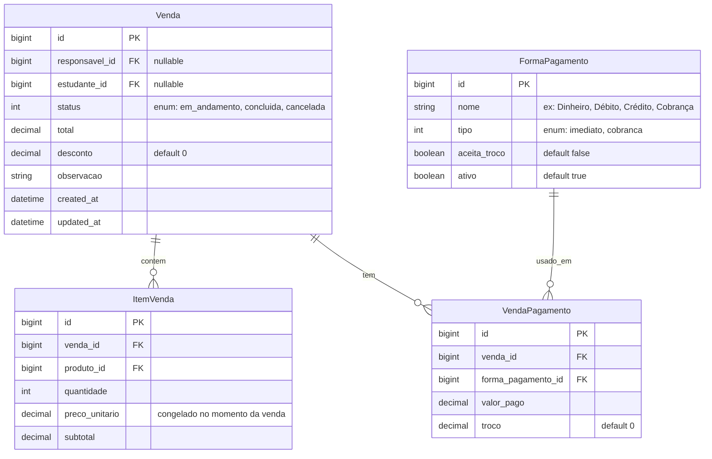

# Plano da Página de Vendas — SICAE

## Stack relevante

- **Rails 8.1** / Ruby 3.3.5 / PostgreSQL
- **Tailwind v4** + Flowbite (dark mode via `class`)
- **Hotwire** (Turbo + Stimulus)
- **Importmap** (sem Webpack/Esbuild)
- **Pagy** (paginação), **Pundit** (autorização), **Devise** (autenticação)
- **DataTableable** concern (busca/ordenação)
- **Multi-tenancy**: PostgreSQL schemas (um schema por escola)

---

## Modelos existentes que serão usados

| Modelo | Tabela | Relevância |
|---|---|---|
| `Produto` | por tenant | Itens a vender, com estoque, ativo/inativo |
| `Categoria` | por tenant | Classificação dos produtos |
| `ItemPreco` / `TabelaPreco` | por tenant | Preço vigente dos produtos |
| `Estudante` | `public` | Vinculado a `Responsavel`, tem `matricula` |
| `Responsavel` | `public` | Vinculado a `User`, tem `estudantes` |
| `Bloqueio` | por tenant | Restringe produto por estudante/período |
| `Reserva` | por tenant | Reserva de produto por estudante/data |

---

## Fase 1 — Modelos novos



### Regras de negócio

- `ItemVenda.preco_unitario` congela o preço no momento da venda (não reflete alterações futuras da tabela de preços)
- Se `FormaPagamento.tipo == "cobranca"`, a venda **obriga** `responsavel_id` e `estudante_id`
- Ao finalizar:
  - Abate o estoque do produto
  - Valida `Bloqueio` ativo do estudante (se modo aluno)
  - Valida `Produto.disponivel?` (ativo e com estoque)
- `FormaPagamento` é configurável por escola (seed inicial com 4 padrões)

---

## Fase 2 — Autenticação do aluno

Abordagem simples (sem senha):

1. Campo "Matrícula do aluno" no topo da tela de vendas
2. Busca: `Estudante.find_by(matricula: params[:matricula])`
3. Exibe confirmação com nome, turma e série
4. Ao confirmar: carrega os `Bloqueio` ativos e libera modo "cobrança"
5. Opção "Pular" → segue em modo venda livre (sem vínculo com aluno)

### Evolução futura
- Adicionar coluna `pin` (4 dígitos) em `Estudante`
- Validação do PIN após digitar a matrícula
- Responsável define o PIN pelo painel dele

---

## Fase 3 — Layout da tela (desktop / balcão)

```
┌──────────────────────────────────────────────────────────────┐
│ 🏫 Instituto Estrela da Manhã     📅 24/06     👤 Operador   │
├──────────────────────────────────────────────────────────────┤
│ [🔍 Matrícula do aluno...]  [✔ Confirmar]  [⏭ Pular]        │
│ Aluno: João Silva · 3°A                                      │
├──────────────────────────────────┬───────────────────────────┤
│         CATÁLOGO                 │      CARRINHO             │
│                                  │                           │
│ ┌──────┐ ┌──────┐ ┌──────┐     │  Item        Qtd    R$    │
│ │Coxinha│ │Suco  │ │Salad │     │  Coxinha      2   16,00   │
│ │ R$8   │ │R$5   │ │R$12  │     │  Suco         1    5,00   │
│ │[+]    │ │[+]   │ │[+]   │     │  ─────────────────────   │
│ └──────┘ └──────┘ └──────┘     │  TOTAL             21,00 │
│                                  │                           │
│ ┌──────┐                         │  Pagamento:               │
│ │Pão   │   🚫 Coxinha           │  ○ Dinheiro  ○ Débito     │
│ │ R$4  │   (bloqueado p/ aluno) │  ○ Crédito  ○ Cobrança   │
│ │[+]   │                         │                           │
│ └──────┘                         │  [💰 Finalizar Venda]    │
│                                  │                           │
│ Busca: [....................]    │  Troco para: [R$____]     │
│                                  │                           │
└──────────────────────────────────┴───────────────────────────┘
```

### Componentes da tela

| Componente | Descrição |
|---|---|
| **Barra de identificação** | Input de matrícula + botão confirmar/pular |
| **Grade de produtos** | Grid responsivo com cards de produto, preço e botão adicionar |
| **Badge de bloqueio** | Overlay 🚫 em produtos bloqueados (visível apenas no modo aluno) |
| **Carrinho (sidebar)** | Itens adicionados, controle de quantidade, subtotais e total |
| **Seletor de pagamento** | Radio buttons; "Cobrança" aparece apenas no modo aluno |
| **Calculadora de troco** | Input "valor recebido" → calcula troco automaticamente |
| **Barra de busca** | Filtro por nome do produto no catálogo |

---

## Fase 4 — Fluxo completo

```
         ┌──────────┐
         │ Tela     │
         │ inicial  │
         └────┬─────┘
              │
    ┌─────────┴──────────┐
    ▼                    ▼
┌──────────────┐   ┌──────────────────┐
│ Modo Livre   │   │ Modo Aluno       │
│ (sem aluno)  │   │ Digita matrícula │
│              │   │ Confirma         │
└──────┬───────┘   └────────┬─────────┘
       │                    │
       ▼                    ▼
┌──────────────────────────────────────┐
│ Adiciona produtos ao carrinho        │
│ • Valida estoque                     │
│ • Valida bloqueios (se modo aluno)   │
└──────────────┬───────────────────────┘
               ▼
┌──────────────────────────────────────┐
│ Escolhe forma de pagamento           │
│ • "Cobrança" só disponível c/ aluno  │
│ • Se dinheiro: informa valor recebido│
└──────────────┬───────────────────────┘
               ▼
┌──────────────────────────────────────┐
│ Finaliza venda                       │
│ • Cria Venda + Itens                 │
│ • Abate estoque                      │
│ • Se cobrança: vincula ao responsável│
│ • Exibe comprovante                  │
└──────────────────────────────────────┘
```

---

## Fase 5 — O que construir (por ordem)

| # | Tarefa | Tipo | Arquivos esperados |
|---|---|---|---|
| 1 | Migrations: `Venda`, `ItemVenda`, `FormaPagamento`, `VendaPagamento` | `db/migrate/` | 4 arquivos de migration |
| 2 | Modelos: `Venda`, `ItemVenda`, `FormaPagamento`, `VendaPagamento` | `app/models/` | 4 arquivos + associações |
| 3 | Seed de `FormaPagamento` (Dinheiro, Débito, Crédito, Cobrança) | `db/seeds/` | 1 arquivo |
| 4 | Policy: `VendaPolicy` | `app/policies/` | 1 arquivo |
| 5 | Rotas: `resources :vendas` + `resources :forma_pagamentos` | `config/routes.rb` | alteração nas rotas |
| 6 | Controller: `VendasController` (new, create, index, show) | `app/controllers/` | 1 controller |
| 7 | Views: catálogo, carrinho, checkout, comprovante | `app/views/vendas/` | 4+ templates |
| 8 | Stimulus controller para interação do carrinho | `app/javascript/controllers/` | 1 controller JS |
| 9 | Integração com bloqueios e validação no backend | `app/models/` + controller | validações |

---

## Observações

- O carrinho pode ser mantido em **session** (já que é por atendimento) ou em memória com Turbo Streams
- A tela de vendas **não precisa de DataTableable** (não é uma listagem)
- `ProdutosController` tem `authenticate_user!` e `verify_authorized` **comentados** — verificar se será necessário para vendas
- A `Venda` pertence à escola via tenant (esquema), e os models per-tenant já seguem esse padrão
- `FormaPagamento` é por tenant (cada escola configura as próprias formas)
